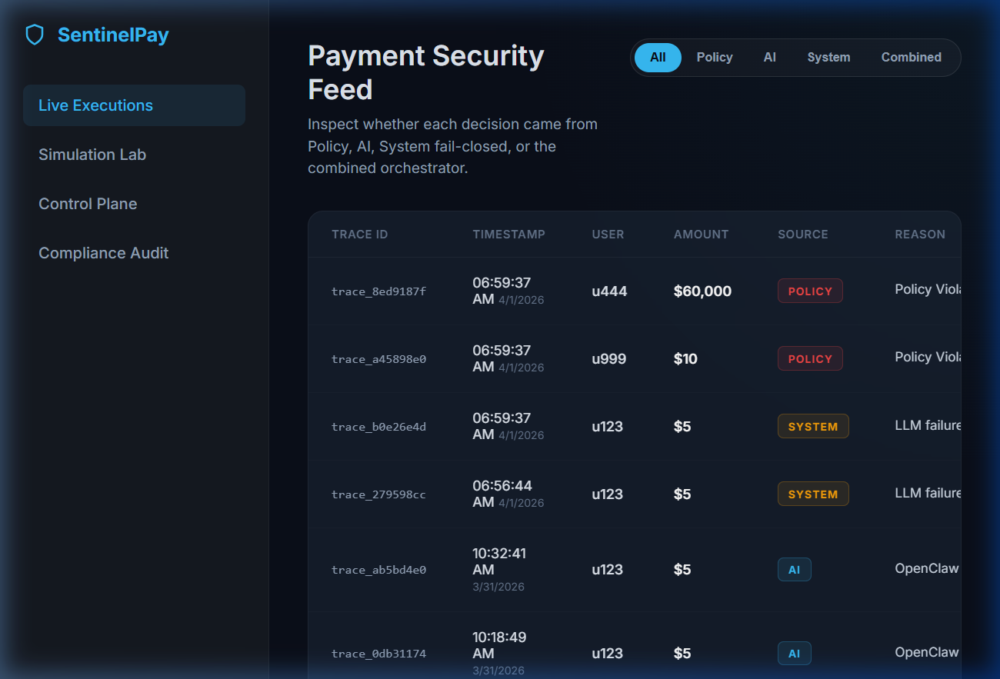
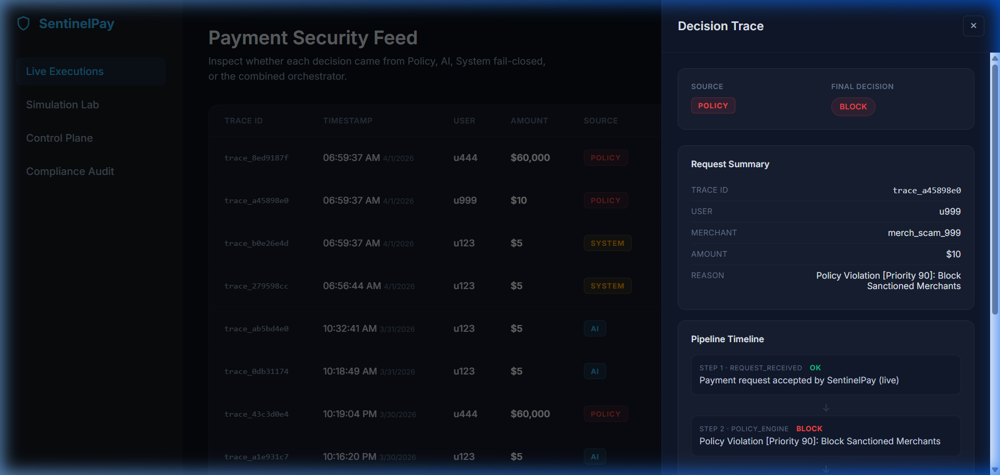
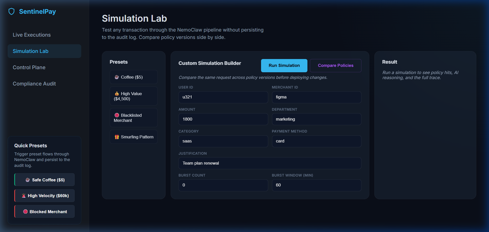
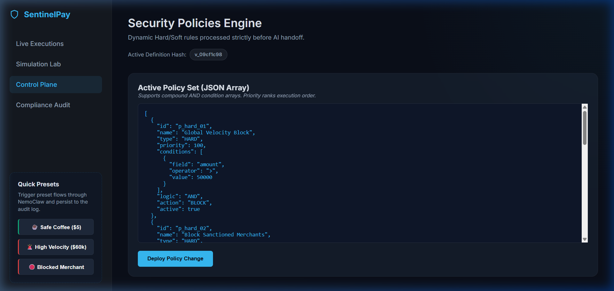
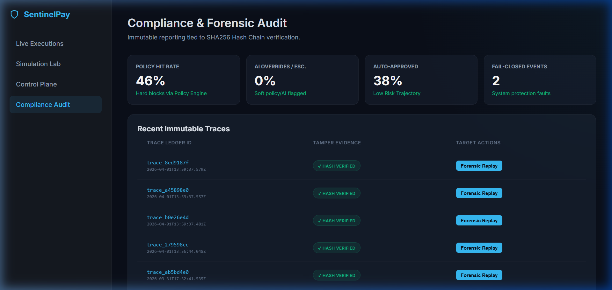

# SentinelPay | AI Payment Guardian

> 🦀 **Powered by SentinelPay Agent** — the agentic AI reasoning framework that stops fraudulent payments *before* your money leaves the bank.

SentinelPay is an intelligent, agentic payment security system that intercepts and evaluates transactions in real-time through a multi-tier pipeline. Rather than reacting to fraud after the fact, it combines deterministic hard/soft policies with the **SentinelPay Agent 🦀 AI reasoning layer** to deliver fast, explainable, and auditable payment decisions — every single time.

---

## 🦀 What is SentinelPay Agent?

**SentinelPay Agent** is a free and open-source autonomous artificial intelligence agent that can execute tasks via large language models.

In **SentinelPay**, we have adapted the SentinelPay Agent agent to serve as our core AI reasoning engine. It sits directly between the deterministic Policy Engine and the final transaction decision, acting as a model-agnostic risk evaluator.

When a transaction clears all hard policy rules but still feels *off* — high spend, unusual vendor, suspicious justification — **SentinelPay Agent takes over**. It evaluates the full transaction context and produces a structured forensic decision with:

- ✅ A **risk score** (0.0 → 1.0)
- ✅ A **decision suggestion** (`APPROVE`, `ESCALATE`, or `BLOCK`)
- ✅ A **confidence rating**
- ✅ A list of **human-readable risk signals**
- ✅ A **forensic explanation** written in plain English

SentinelPay Agent is backed by **Google Gemini 2.5** via the `@google/genai` SDK, with a strict JSON schema enforced by Zod to ensure structured, reliable outputs every time — no hallucinations, no freeform text.

> **No black boxes.** SentinelPay Agent tells you *why* it made its call, every time.

---

## 📸 Dashboard & Interface

**Live Execution Feed**

*A real-time feed of transaction traces tagged with their decision source — POLICY, AI (SentinelPay Agent), SYSTEM fail-closed, or COMBINED.*

**Decision Trace Detail**

*Full forensic drill-down: see exactly which pipeline stage blocked or approved the payment, with SentinelPay Agent's reasoning baked in.*

**Simulation Lab**

*Test any transaction through the DecisionEngine pipeline — without persisting to logs — and compare policy versions side by side.*

**Control Plane**

*Live view and tuning of compound Hard/Soft JSON policy rules, with a definition hash to track versioned deployments.*

**Compliance Audit**

*Hash-chained append-only JSONL audit logs — tamper-evident and forensically complete.*

---

## ✨ Key Features

1. 🔒 **Hard Policy Engine** — Zero-tolerance rules instantly BLOCK bad actors, velocity fraud, and sanctioned merchants. SentinelPay Agent is never invoked, keeping response times under 5ms.
2. 🦀 **AI Agent Reasoning** — For ambiguous transactions, SentinelPay Agent evaluates the full business context with Gemini. It returns a confidence-weighted, signal-backed decision — not just a label.
3. 🛡️ **DecisionEngine Fail-Closed Orchestrator** — If SentinelPay Agent times out or the LLM errors, the pipeline instantly fails closed to `BLOCK`. Security is never optional.
4. 🔍 **Agentic Explainability** — Every decision is tagged with a `decisionSource` (`POLICY`, `AI`, `SYSTEM`, or `COMBINED`) so you always know who made the call and why.
5. 🧪 **Simulation Lab** — Preview any transaction through the full DecisionEngine pipeline, compare current vs draft policies side-by-side, and replay historical traces.
6. 📋 **Cryptographic Audit Trail** — All decisions are hash-chained into an append-only JSONL log for tamper-evident compliance records.

---

## 🛠️ Tech Stack

| Layer | Technology |
|---|---|
| Backend | Node.js & Express |
| AI Engine | Google Gemini 2.5 via `@google/genai` |
| AI Framework | **SentinelPay Agent 🦀** (generic LLM adapter pattern) |
| Orchestration | **DecisionEngine** (Policy + AI pipeline coordinator) |
| Schema Validation | Zod (strict structured output enforcement) |
| Data Persistence | Append-only JSONL + JSON policy store |

---

## 🚀 Installation & Setup

1. **Clone the repository**
   ```bash
   git clone https://github.com/HardeepPatel/SentinelPay.git
   cd SentinelPay
   ```

2. **Install Dependencies**
   ```bash
   npm install
   ```

3. **Configure Environment Variables**
   Create a `.env` file in the root directory:
   ```env
   GEMINI_API_KEY=your_gemini_api_key_here
   GEMINI_MODEL=gemini-2.5
   PORT=3000
   ```

4. **Start the Application**
   ```bash
   npm start
   ```

5. **Open the Dashboard**
   Navigate to [http://localhost:3000](http://localhost:3000) in your browser.

---

## 🏗️ Pipeline Architecture

```
Payment Request
      │
      ▼
┌─────────────────┐
│  Policy Engine  │ ◄── Hard BLOCK? → STOP. Decision: POLICY
│  (data/policies)│ ◄── Soft flag?  → Continue to SentinelPay Agent
└────────┬────────┘
         │
         ▼
┌─────────────────┐
│  SentinelPay Agent 🦀    │ ◄── LLM timeout? → Fail-closed: SYSTEM BLOCK
│  (Gemini 2.5)   │ ◄── Analysis OK? → APPROVE / ESCALATE / BLOCK
└────────┬────────┘
         │
         ▼
┌─────────────────────────┐
│  DecisionEngine Orchestrator  │ ◄── Merges policy + AI → Final Decision
│  decisionSource tagged  │     (POLICY | AI | SYSTEM | COMBINED)
└────────┬────────────────┘
         │
         ▼
┌─────────────────┐
│   Audit Logger  │ ◄── Hash-chained JSONL entry persisted
└─────────────────┘
```
